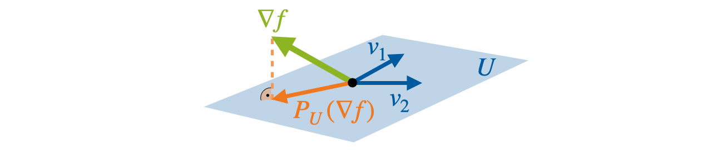

# Beyond Backpropagation: Optimization with Multi-Tangent Forward Gradients

[](./LICENSE)
[](https://www.python.org/downloads/)
[](mailto:katharina.fluegel@kit.edu)
[](https://arxiv.org/)

Forward gradients are an approach to approximate gradients from directional derivatives along random tangents.
Multi-tangent forward gradients improve this approximation by aggregating over multiple tangents.

This repository provides experimental code to analyze multi-tangent forward gradients along with instructions on how to reproduce the results of our paper "Beyond Backpropagation: Optimization with Multi-Tangent Forward Gradients".

For more details, check out our preprint: *[coming soon]*

If you find this repository useful, please cite our paper as: *[coming soon]*

- [Intro to Multi-Tangent Forward Gradients](#intro-to-multi-tangent-forward-gradients)
- [Installation](#installation)
- [Usage](#usage)

## Intro to Multi-Tangent Forward Gradients
Gradient descent is a powerful to optimize differentiable functions and drives the training of most modern neural networks.
The necessary gradients are typically computed using backpropagation.
However, the alternating forward and backward passes make it biologically implausible and hinder parallelization.

### What are Forward Gradients?

Forward gradients are a way to approximate the gradient using forward-mode automatic differentiation (AD) along a specific tangent direction.
This is more efficient than full forward-mode AD, which requires as many passes as parameters, while still being free of backward passes through the model.

These forward gradients have multiple nice properties, for example:
- A forward gradient is an unbiased estimator of the gradient for a random tangent $\sim\mathcal{N}(0, I_n)$
- A forward gradient is always a descending direction
- A forward gradient is always (anti-)parallel to it's corresponding tangent. 

The following figure illustrates a forward gradient $g_v$ for the tangent $v$ and the gradient $\nabla f$.


However, as the dimension increases, the variance of the forward gradient increases, and with it, the approximation quality decreases.
Essentially, the forward gradient limits the high-dimensional gradient to a single dimension, that of the tangent.
This approximation of course depends strongly on how close the selected tangent is to the gradient.
In high dimensional spaces, a random tangent is quite unlikely to be close to the gradient and is in fact expected to be near-orthogonal to the gradient.

### Multi-Tangent Forward Gradients
Multi-tangent forward gradients aggregate the forward gradients over multiple tangents.
This improves the approximation quality and enable the optimization of higher dimensional problems.
This repository offers multiple different aggregation approaches, from simple sums and averages to the provably most accurate orthogonal projection.

The following figure illustrates the orthogonal projection $P_U(\nabla f)$ of a gradient $\nabla f$ on the subspace $U$ spanned by the tangents $v_1$ and $v_2$.




## Installation
Our experiments were implemented using Python 3.9, newer versions of python might work but have not yet been tested.
It is recommended to create a new virtual environment.
Then, install the requirements from `requirements.txt`, e.g. with
```bash
pip install -r requirements.txt
```

## Usage

### Reproducing our results
Here, we give instructions on how to reproduce the experimental results presented in Section 4.
The outputs of all our experiments are automatically saved to `results/` and ordered by date and experiment.
All the following scripts come with a command-line interface. 
Use `--help` to find out more about additional parameters, e.g. to reduce the number of samples, seeds, or epochs.

#### Approximation Quality (Section 4.1)
To evaluate the cosine similarity and norm of the forward gradients compared to the true gradient $\nabla f$, call
```bash
  PYTHONPATH=. python approximation_quality.py
```
You can reduce the number of samples via the `--num_samples` to get faster results.


#### Optimization of Closed-Form Functions (Section 4.2)
To reproduce the optimization of the closed-form functions, set `<function>` to `sphere`, `rosenbrock`, or `styblinski-tang` and call
```bash
 PYTHONPATH=. python function_optimization/math_experiments.py --function <function> math_experiments
```
This runs the optimization for all gradient approaches and all dimensions $n$, automatically reading the corresponding learning rate from `lrs/math.csv`.

#### Using Custom Tangents (Section 4.3)
To reproduce the approximation quality and optimization results for tangents with specific angles to the first tangent, call
```bash
  PYTHONPATH=. python approximation_quality.py --tangents angle --angles 15 30 45 60 75 90
```
and
```bash
  PYTHONPATH=. python function_optimization/math_experiments.py --function styblinski-tang custom_tangents
```

#### Neural Network Training (Sections 4.4 and 4.5)

The `nn_training/train.py` provides the interface to train neural networks with different gradients.
It downloads the datasets automatically to `data/`.

To specify the gradient, use
- `<GRADIENT>=bp` for the true gradient $\nabla f$ obtained via backpropagation 
- `<GRADIENT>=fg` and `<K>=1` for the single-tangent forward gradient baseline $g_v$
- `<GRADIENT>=fg` and `<K>` in `2`, `4`, `16` for multi-tangent forward gradient with mean aggregation $\overline{g_V}$
- `<GRADIENT>=frog` and `<K>` in `2`, `4`, `16` for multi-tangent forward gradient with orthogonal projection $P_U$

The learning rate `<LR>` should be set according to the tables given in the appendix or `lrs/fc_nns.csv` and `lrs/sota_nns.csv`. 
The random seed is set via `<SEED>`, we used seeds `0` to `2`.
Pass `--device cuda` to use the GPU.

For the fully-connected neural networks trained in Section 4.4, use
```bash
PYTHONPATH=. python nn_training/train.py --model fc --model_hidden_size <WIDTH> --experiment_id fc_nn --output_name fc_w<WIDTH> --gradient_computation <GRADIENT> --num_directions <K> --initial_lr <LR> --seed <SEED>
```
for the hidden layer width `<WIDTH>` set to `256`, `1024`, or `4096`. 

For ResNet18 and ViT trained in Section 4.5, use
```bash
PYTHONPATH=. python nn_training/train.py --model <MODEL> --dataset <DATASET> --experiment_id sota_nn --output_name <MODEL>_<DATASET> --gradient_computation <GRADIENT> --num_directions <K> --initial_lr <LR> --seed <SEED>
```
with `<MODEL>` set to `resnet18` or `vit` and `<DATASET>` set to `mnist` or `cifar10`.


### Learning Rate Search
Code and instructions to run the learning rate search are given in `lr_search/`.
The learning rates determined by the search are given as CSV files in `lrs/`.